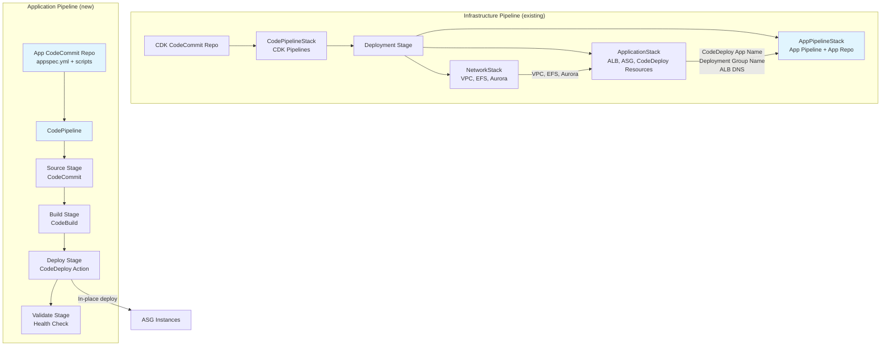
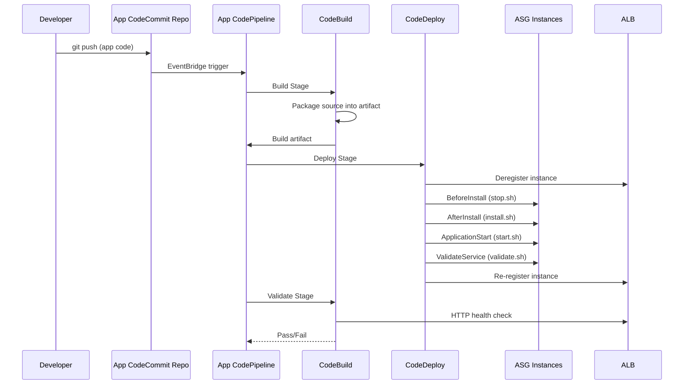

# Design Document: App Pipeline Separation

## Overview

This design separates the Moodle application deployment lifecycle from the infrastructure deployment lifecycle. Today, the single `CodePipelineStack` watches the CDK repository and deploys both `NetworkStack` and `ApplicationStack` together — any infrastructure change triggers an application redeployment, and deploying new application code requires modifying CDK source.

The solution introduces three changes:

1. **ApplicationStack modifications**: Strip Moodle application code from UserData (keep only base OS dependencies + CodeDeploy agent), and add CodeDeploy Application + Deployment Group resources so the ASG is ready to receive deployments.
2. **New AppPipelineStack**: A separate CDK stack that creates a CodePipeline watching a dedicated application CodeCommit repository. This pipeline builds the app artifact and deploys it via CodeDeploy, followed by a health-check validation stage.
3. **Deployment stage and entry point updates**: The `Deployment` stage in `stages.ts` and the standalone entry point in `bin/code_pipeline.ts` are updated to instantiate `AppPipelineStack` alongside the existing stacks.

After this change, two independent CI/CD paths exist:
- **Infrastructure pipeline** (`CodePipelineStack`): CDK repo → synth → deploy NetworkStack + ApplicationStack + AppPipelineStack
- **Application pipeline** (`AppPipelineStack`): App repo → build → CodeDeploy to ASG → health check

### Design Decisions

1. **Standard CodePipeline (not CDK Pipelines) for AppPipelineStack**: The existing `CodePipelineStack` uses CDK Pipelines (`aws-cdk-lib/pipelines`) because it needs self-mutation. The `AppPipelineStack` uses the lower-level `aws-codepipeline` + `aws-codepipeline-actions` constructs because it is a simple source → build → deploy → validate pipeline with no CDK synthesis or self-mutation needed.

2. **CodeDeploy resources in ApplicationStack, not AppPipelineStack**: The CodeDeploy Application and Deployment Group are tightly coupled to the ASG (they reference it directly). Placing them in `ApplicationStack` keeps the compute platform self-contained and avoids circular cross-stack references. The `AppPipelineStack` receives the CodeDeploy resource names as string props.

3. **In-place deployment with ALB traffic management**: CodeDeploy `ServerDeploymentGroup` with `loadBalancers` configured to the ALB target group. This deregisters instances from the target group during deployment and re-registers them after, providing zero-downtime rolling deployments without requiring blue/green infrastructure.

4. **`installAgent: false` on ServerDeploymentGroup**: The CDK `ServerDeploymentGroup` construct defaults to injecting CodeDeploy agent install UserData when `installAgent: true`. Since we install the agent explicitly in our own UserData (to control the exact install method and ensure it starts as a service), we set `installAgent: false` to avoid duplicate/conflicting UserData entries.

5. **App repository seed files as CDK `Code.fromAsset`**: The `AppPipelineStack` creates the CodeCommit repository with initial content using `Code.fromAsset()` pointing to a local `app-repo/` directory. This seeds the repo with `appspec.yml` and lifecycle scripts on first deployment.

## Architecture



### Deployment Flow



## Components and Interfaces

### Modified: ApplicationStack (`lib/application-stack.ts`)

**Changes from current implementation:**

1. **UserData**: Replace the current hello-world HTML with base dependency installation:
   - Apache httpd, PHP 8.x, PHP extensions (mysqlnd, xml, mbstring, gd, intl, zip, soap, opcache)
   - NFS utilities + EFS mount to `/var/www/moodledata`
   - CodeDeploy agent installation from the AWS S3 bucket
   - Start and enable httpd + codedeploy-agent services
   - No Moodle source code, no `config.php` generation

2. **New CodeDeploy resources**:
   - `codedeploy.ServerApplication` — compute platform Server
   - `codedeploy.ServerDeploymentGroup` — associated with the ASG, ALB target group as load balancer, `installAgent: false`, `ALL_AT_ONCE` deployment config

3. **New public readonly properties**:
   - `codeDeployApp: codedeploy.ServerApplication`
   - `deploymentGroup: codedeploy.ServerDeploymentGroup`
   - `albDnsName: string`

4. **New CloudFormation outputs**:
   - `CodeDeployApplicationName`
   - `CodeDeployDeploymentGroupName`

5. **IAM permissions**:
   - ASG instance role gets CodeDeploy agent permissions (managed policy `AmazonEC2RoleforAWSCodeDeploy` is added by the CDK `ServerDeploymentGroup` construct when `autoScalingGroups` is set)
   - ASG instance role gets S3 read access for deployment artifacts (handled by CodeDeploy construct)
   - Aurora secret read permission (already exists)

**Updated interface:**

```typescript
export interface ApplicationStackProps extends StackProps {
  vpc: ec2.Vpc
  fileSystem: efs.FileSystem
  auroraCluster: rds.DatabaseCluster
  efsSg: ec2.SecurityGroup
  auroraSg: ec2.SecurityGroup
}

export class ApplicationStack extends Stack {
  public readonly codeDeployApp: codedeploy.ServerApplication
  public readonly deploymentGroup: codedeploy.ServerDeploymentGroup
  public readonly albDnsName: string
  // ... constructor
}
```

### New: AppPipelineStack (`lib/app-pipeline-stack.ts`)

Creates the application deployment pipeline and the application source repository.

```typescript
export interface AppPipelineStackProps extends StackProps {
  /** Name of the CodeDeploy Application from ApplicationStack */
  codeDeployAppName: string
  /** Name of the CodeDeploy Deployment Group from ApplicationStack */
  deploymentGroupName: string
  /** ALB DNS name for health check validation */
  albDnsName: string
}

export class AppPipelineStack extends Stack {
  constructor(scope: Construct, id: string, props: AppPipelineStackProps) {
    // ...
  }
}
```

**Resources created:**

| Resource | Type | Purpose |
|----------|------|---------|
| App CodeCommit Repository | `codecommit.Repository` | Holds Moodle app code, appspec.yml, lifecycle scripts. Seeded with `Code.fromAsset('app-repo')`. |
| CodePipeline | `codepipeline.Pipeline` | Orchestrates Source → Build → Deploy → Validate |
| Source Action | `CodeCommitSourceAction` | Watches `main` branch of app repo |
| Build Project | `codebuild.PipelineProject` | Packages source into deployment artifact (zip) |
| Deploy Action | `CodeDeployServerDeployAction` | Deploys build artifact to the CodeDeploy Deployment Group |
| Validate Project | `codebuild.PipelineProject` | Runs HTTP health check against ALB |

**CloudFormation Outputs:**
- `AppRepositoryName` — the app repository name
- `AppRepositoryCloneUrl` — HTTPS clone URL

**Pipeline stages:**

1. **Source**: `CodeCommitSourceAction` on `main` branch
2. **Build**: `CodeBuildAction` — runs a simple `zip` of the source into a deployment artifact
3. **Deploy**: `CodeDeployServerDeployAction` — deploys to the imported `ServerDeploymentGroup`
4. **Validate**: `CodeBuildAction` — HTTP health check with retry loop against ALB DNS

### Modified: Deployment Stage (`lib/stages.ts`)

```typescript
export class Deployment extends Stage {
  constructor(scope: Construct, id: string, props?: StageProps) {
    super(scope, id, props)

    const networkStack = new NetworkStack(this, 'NetworkStack', { ... })
    const applicationStack = new ApplicationStack(this, 'ApplicationStack', { ... })
    applicationStack.addDependency(networkStack)

    // NEW: Add AppPipelineStack
    const appPipelineStack = new AppPipelineStack(this, 'AppPipelineStack', {
      codeDeployAppName: applicationStack.codeDeployApp.applicationName,
      deploymentGroupName: applicationStack.deploymentGroup.deploymentGroupName,
      albDnsName: applicationStack.albDnsName,
    })
    appPipelineStack.addDependency(applicationStack)
  }
}
```

### Modified: Entry Point (`bin/code_pipeline.ts`)

Add standalone `AppPipelineStack` for manual `cdk deploy`:

```typescript
const app = new cdk.App()
new CodePipelineStack(app, 'CodePipeline')

const networkStack = new NetworkStack(app, 'Dev-NetworkStack')
const applicationStack = new ApplicationStack(app, 'Dev-ApplicationStack', { ... })

// NEW
new AppPipelineStack(app, 'Dev-AppPipelineStack', {
  codeDeployAppName: applicationStack.codeDeployApp.applicationName,
  deploymentGroupName: applicationStack.deploymentGroup.deploymentGroupName,
  albDnsName: applicationStack.albDnsName,
})
```

### New: Application Repository Structure (`app-repo/`)

```
app-repo/
├── appspec.yml
├── index.html          # Placeholder Moodle entry point
└── scripts/
    ├── stop.sh         # BeforeInstall: stop httpd
    ├── install.sh      # AfterInstall: install app files, generate config.php
    ├── start.sh        # ApplicationStart: start httpd
    └── validate.sh     # ValidateService: local health check
```

**`appspec.yml`:**
```yaml
version: 0.0
os: linux
files:
  - source: /
    destination: /var/www/html
hooks:
  BeforeInstall:
    - location: scripts/stop.sh
      timeout: 60
      runas: root
  AfterInstall:
    - location: scripts/install.sh
      timeout: 120
      runas: root
  ApplicationStart:
    - location: scripts/start.sh
      timeout: 60
      runas: root
  ValidateService:
    - location: scripts/validate.sh
      timeout: 120
      runas: root
```

## Data Models

### AppPipelineStackProps

| Property | Type | Required | Description |
|----------|------|----------|-------------|
| `codeDeployAppName` | `string` | Yes | CodeDeploy Application name from ApplicationStack |
| `deploymentGroupName` | `string` | Yes | CodeDeploy Deployment Group name from ApplicationStack |
| `albDnsName` | `string` | Yes | ALB DNS name for health check validation |

### ApplicationStackProps (unchanged interface, new outputs)

The `ApplicationStackProps` interface remains the same. The stack gains three new public readonly properties:

| Property | Type | Description |
|----------|------|-------------|
| `codeDeployApp` | `codedeploy.ServerApplication` | The CodeDeploy Application resource |
| `deploymentGroup` | `codedeploy.ServerDeploymentGroup` | The CodeDeploy Deployment Group |
| `albDnsName` | `string` | The ALB DNS name string |

### CodeDeploy Lifecycle Hook Mapping

| Hook | Script | Timeout | Purpose |
|------|--------|---------|---------|
| BeforeInstall | `scripts/stop.sh` | 60s | Stop Apache before new files are copied |
| AfterInstall | `scripts/install.sh` | 120s | Install Moodle files, retrieve Aurora secret, generate `config.php` |
| ApplicationStart | `scripts/start.sh` | 60s | Start Apache |
| ValidateService | `scripts/validate.sh` | 120s | `curl localhost` health check |


## Error Handling

### CDK Synthesis Errors

| Error Scenario | Cause | Handling |
|----------------|-------|----------|
| Missing cross-stack props | `ApplicationStack` properties not wired to `AppPipelineStack` | TypeScript compilation error — caught at build time |
| Circular dependency | Incorrect stack dependency ordering | CDK synthesis error — caught by `cdk synth` |
| Invalid CodeDeploy config | Misconfigured deployment group (e.g., missing ASG) | CloudFormation deployment error — caught during `cdk deploy` |

### Runtime Deployment Errors

| Error Scenario | Cause | Handling |
|----------------|-------|----------|
| CodeDeploy agent not running | UserData install failure | Instance fails to receive deployments; CodeDeploy times out and rolls back |
| EFS mount failure | NFS utilities not installed or EFS SG misconfigured | UserData script exits with `set -e`; instance marked unhealthy by ASG |
| Lifecycle script failure | `install.sh` fails (e.g., Secrets Manager access denied) | CodeDeploy marks deployment as failed; auto-rollback triggers |
| Health check failure | Application not responding after deployment | Validate stage fails; pipeline halts. CodeDeploy deployment group can be configured for auto-rollback |
| Aurora secret retrieval failure | Missing IAM permissions on instance role | `install.sh` fails; CodeDeploy rolls back deployment |

### Pipeline Error Handling

- **Build stage failure**: CodeBuild project fails to package artifact → pipeline halts at Build stage
- **Deploy stage failure**: CodeDeploy deployment fails (script error, timeout) → pipeline halts at Deploy stage; CodeDeploy auto-rollback restores previous revision
- **Validate stage failure**: Health check fails after retries → pipeline halts at Validate stage; manual investigation required
- **Source stage failure**: CodeCommit repo inaccessible → pipeline halts at Source stage

## Testing Strategy

### Why Property-Based Testing Does Not Apply

This feature is entirely Infrastructure as Code (CDK/CloudFormation). All acceptance criteria describe declarative resource configuration — resources either exist with the correct properties or they don't. The behavior does not vary meaningfully with input, and there are no pure functions with input/output behavior to test. CDK Template assertion tests are the appropriate testing approach.

### Unit Tests (CDK Template Assertions)

All unit tests use `aws-cdk-lib/assertions` `Template` class to verify synthesized CloudFormation templates.

#### ApplicationStack Tests (`test/application-stack.test.ts`)

**Existing tests** (preserved):
- ALB is internet-facing
- ALB listener on port 80
- ASG capacity min 1, max 2
- ASG instance type is t3.medium
- AlbDnsName output exists

**New tests:**
| Test | Assertion | Validates |
|------|-----------|-----------|
| CodeDeploy Application exists with Server platform | `resourceCountIs('AWS::CodeDeploy::Application', 1)` + `hasResourceProperties` with `ComputePlatform: 'Server'` | Req 2.1 |
| CodeDeploy Deployment Group exists | `resourceCountIs('AWS::CodeDeploy::DeploymentGroup', 1)` | Req 2.2 |
| Deployment Group uses in-place deployment | `hasResourceProperties` with `DeploymentStyle.DeploymentType: 'IN_PLACE'` | Req 2.3 |
| Deployment Group has ALB target group | `hasResourceProperties` with `LoadBalancerInfo.TargetGroupInfoList` | Req 2.4 |
| CodeDeployApplicationName output exists | `hasOutput('CodeDeployApplicationName', {})` | Req 2.7 |
| CodeDeployDeploymentGroupName output exists | `hasOutput('CodeDeployDeploymentGroupName', {})` | Req 2.7 |
| UserData contains httpd install | Decode UserData base64, check for `dnf install -y httpd` | Req 1.1 |
| UserData contains CodeDeploy agent install | Decode UserData, check for `codedeploy-agent` | Req 1.2 |
| UserData does NOT contain Moodle download | Decode UserData, check absence of `moodle` download commands | Req 1.4, 1.5 |

#### AppPipelineStack Tests (`test/app-pipeline-stack.test.ts`)

**New test file:**
| Test | Assertion | Validates |
|------|-----------|-----------|
| CodeCommit repository exists | `resourceCountIs('AWS::CodeCommit::Repository', 1)` | Req 3.1 |
| CodePipeline exists | `resourceCountIs('AWS::CodePipeline::Pipeline', 1)` | Req 3.2 |
| Pipeline has Source, Build, Deploy, Validate stages | `hasResourceProperties` checking `Stages` array names | Req 3.4, 3.5, 4.1 |
| Deploy stage uses CodeDeploy provider | `hasResourceProperties` with `ActionTypeId.Provider: 'CodeDeploy'` | Req 3.5 |
| AppRepositoryName output exists | `hasOutput('AppRepositoryName', {})` | Req 3.6 |
| AppRepositoryCloneUrl output exists | `hasOutput('AppRepositoryCloneUrl', {})` | Req 3.7 |

#### Pipeline Stack Tests (`test/pipeline-stack.test.ts`)

**Updated tests:**
- Update expected CodeBuild project count to reflect AppPipelineStack addition in Deployment stage
- Update expected S3 bucket count
- Update expected IAM role count
- Verify Dev stage still exists, no Test/Prod stages

### Integration Tests

Integration tests are executed post-deployment by the existing `test/test_validate.sh` script and the new Validate stage in the app pipeline:

- **Infrastructure pipeline post-deploy**: Existing `test_validate.sh` verifies stack status and ALB health check
- **App pipeline Validate stage**: CodeBuild step performs HTTP health check against ALB with retry loop (max 10 retries, 30s interval)

### Test Execution

```bash
# Run all unit tests
npm test

# Run specific test file
npx jest test/app-pipeline-stack.test.ts

# Synthesize to verify no CDK errors
npx cdk synth
```
