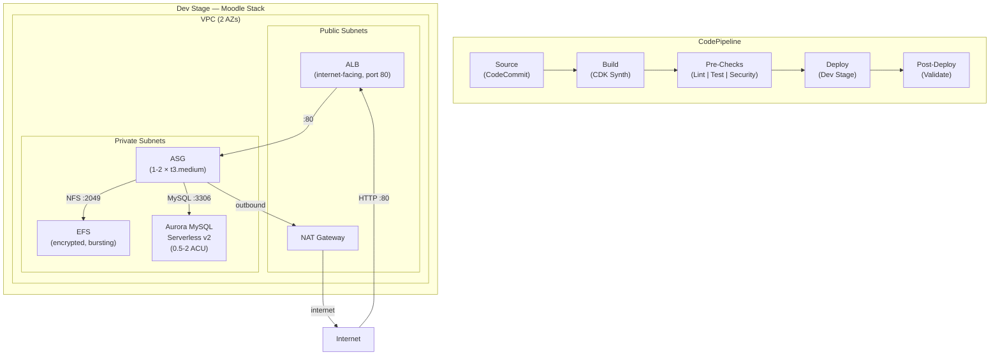
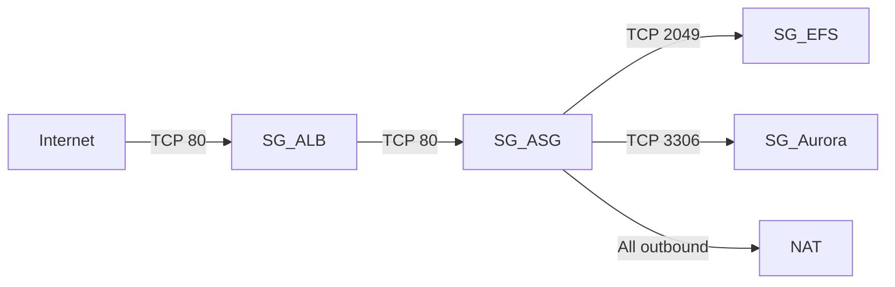

# Design Document: Moodle Dev CI/CD Pipeline

## Overview

This design transforms the existing AWS CodePipeline CI/CD sample project from a multi-stage EventBus deployment into a single-stage Moodle development pipeline. The pipeline retains its Source → Build → Pre-checks → Deploy → Validate structure but targets a Moodle application stack instead of an EventBus stack.

The Moodle infrastructure consists of:
- **VPC** with public/private subnets across 2 AZs, NAT Gateway for outbound internet
- **ALB** (internet-facing, port 80) distributing traffic to Moodle EC2 instances
- **ASG** (1–2 t3.medium instances, Amazon Linux 2023) running Moodle via UserData bootstrap
- **EFS** (encrypted, bursting throughput) for shared `/var/moodledata` storage
- **Aurora MySQL Serverless v2** (0.5–2 ACU, single writer) for the Moodle database

The pipeline is trimmed from Dev/Test/Prod to Dev-only. Pre-deployment checks (linting, unit tests, cfn-nag security scan) and post-deployment validation (stack verification, HTTP health check) are preserved and adapted.

### Key Design Decisions

| Decision | Choice | Rationale |
|---|---|---|
| Single stage | Dev only | Lightweight dev iteration; Test/Prod removed per requirements |
| Database | Aurora Serverless v2 | Scales to 0.5 ACU for dev cost savings; MySQL 8.0 compatible with Moodle |
| Shared storage | EFS (not FSx) | Simpler, cheaper for dev; sufficient throughput for moodledata |
| Instance type | t3.medium | 2 vCPU / 4 GB RAM — minimum viable for Moodle + PHP |
| AMI | Amazon Linux 2023 | Long-term support, modern packages, CDK `MachineImage.latestAmazonLinux2023()` |
| Credentials | Secrets Manager | Aurora generates and stores credentials automatically; UserData retrieves at boot |

## Architecture



### Network Flow

1. Internet traffic enters through the ALB on port 80 (public subnets)
2. ALB forwards to ASG instances on port 80 (private subnets)
3. ASG instances mount EFS over NFS port 2049 (private subnets)
4. ASG instances connect to Aurora MySQL on port 3306 (private subnets)
5. ASG instances reach the internet for package installation via NAT Gateway

### Security Group Rules



## Components and Interfaces

### 1. Pipeline Stack (`lib/pipeline-stack.ts`)

**Responsibility:** Defines the CodePipeline with source, synth, pre-deployment checks, Dev stage deployment, and post-deployment validation.

**Changes from current:**
- Remove `testStage` and `prodStage` blocks
- Update `validatePolicy` to include Moodle-relevant permissions (ELB, EFS, RDS describe actions)
- Keep pre-deployment steps (Linting, UnitTest, Security) unchanged
- Update post-deployment Validate step environment and commands

**Interface:**
```typescript
export class CodePipelineStack extends Stack {
  constructor(scope: Construct, id: string, props?: StackProps)
}
```

### 2. Moodle Stack (`lib/main-stack.ts`)

**Responsibility:** Defines all Moodle infrastructure: VPC, ALB, ASG, EFS, Aurora MySQL, security groups, and outputs.

**Replaces:** The current EventBus-based `MainStack`.

**Interface:**
```typescript
export class MainStack extends Stack {
  public readonly albDnsName: CfnOutput
  public readonly efsFileSystemId: CfnOutput
  public readonly auroraClusterEndpoint: CfnOutput

  constructor(scope: Construct, id: string, props?: StackProps)
}
```

**Internal components created:**
- `ec2.Vpc` — 2 AZs, public + private subnets, NAT Gateway
- `elbv2.ApplicationLoadBalancer` — internet-facing, port 80 listener
- `autoscaling.AutoScalingGroup` — 1–2 instances, t3.medium, Amazon Linux 2023
- `efs.FileSystem` — encrypted, bursting throughput, General Purpose
- `rds.DatabaseCluster` — Aurora MySQL 8.0, Serverless v2 (0.5–2 ACU), single writer
- Security groups for ALB, ASG, EFS, Aurora

### 3. Deployment Stage (`lib/stages.ts`)

**Responsibility:** Wraps the Moodle Stack as a CDK pipeline deployment stage.

**Changes from current:** None structurally — still instantiates `MainStack`. The `MainStack` content changes underneath.

**Interface:**
```typescript
export class Deployment extends Stage {
  constructor(scope: Construct, id: string, props?: StageProps)
}
```

### 4. CDK App Entry Point (`bin/code_pipeline.ts`)

**Responsibility:** Instantiates the pipeline stack and a standalone Dev Moodle stack for local `cdk synth` / `cdk deploy`.

**Changes from current:** Minimal — the `MainStack` import stays the same, but the stack now produces Moodle infrastructure.

```typescript
const app = new cdk.App()
new CodePipelineStack(app, 'CodePipeline')
new MainStack(app, 'Dev-MainStack')
```

### 5. Validation Script (`test/test_validate.sh`)

**Responsibility:** Post-deployment verification that queries CloudFormation outputs and performs an HTTP health check.

**Changes from current:**
- Replace EventBus queries with ALB DNS name output query
- Add HTTP health check via `curl` against the ALB endpoint
- Verify stack exists and is in `CREATE_COMPLETE` or `UPDATE_COMPLETE` state

### 6. Unit Tests (`test/main-stack.test.ts`, `test/pipeline-stack.test.ts`)

**Responsibility:** CDK assertion tests validating synthesized CloudFormation templates.

**Changes:**
- `main-stack.test.ts`: Replace EventBus assertions with VPC, ALB, ASG, EFS, Aurora assertions
- `pipeline-stack.test.ts`: Update resource counts; add assertion that only Dev stage exists (no Test/Prod)

## Data Models

### CloudFormation Outputs

The Moodle Stack exports three outputs consumed by the validation script and useful for cross-stack references:

| Output Key | Value | Consumer |
|---|---|---|
| `AlbDnsName` | ALB DNS hostname | Validation script (HTTP health check), developers |
| `EfsFileSystemId` | EFS file system ID | Informational / debugging |
| `AuroraClusterEndpoint` | Aurora cluster writer endpoint | Informational / debugging |

### UserData Script Parameters

The UserData script receives configuration through CDK token substitution at synth time:

| Parameter | Source | Usage |
|---|---|---|
| EFS File System ID | `fileSystem.fileSystemId` | Mount command: `mount -t nfs4 {id}.efs.{region}.amazonaws.com:/ /var/moodledata` |
| Aurora Cluster Endpoint | `cluster.clusterEndpoint.hostname` | Moodle `config.php` `$CFG->dbhost` |
| Aurora Secret ARN | `cluster.secret.secretArn` | `aws secretsmanager get-secret-value` to retrieve DB credentials |
| AWS Region | `Stack.of(this).region` | EFS DNS name, Secrets Manager API calls |

### Security Group Matrix

| Source SG | Destination SG | Port | Protocol | Purpose |
|---|---|---|---|---|
| 0.0.0.0/0 | ALB SG | 80 | TCP | Public HTTP access |
| ALB SG | ASG SG | 80 | TCP | ALB → Moodle instances |
| ASG SG | EFS SG | 2049 | TCP | NFS mount |
| ASG SG | Aurora SG | 3306 | TCP | MySQL connection |
| ASG SG | 0.0.0.0/0 | All | All | Outbound (NAT for packages) |


## Error Handling

### Pipeline Failures

| Failure Point | Behavior | Recovery |
|---|---|---|
| Linting step fails | Pipeline halts before deployment | Fix lint errors, push to trigger new pipeline run |
| Unit test step fails | Pipeline halts before deployment | Fix failing tests, push to trigger new pipeline run |
| Security scan (cfn-nag) fails | Pipeline halts before deployment | Address security findings, push to trigger new pipeline run |
| CDK synth fails | Pipeline halts at Build stage | Fix CDK code, push to trigger new pipeline run |
| CloudFormation deployment fails | Pipeline reports Dev stage failure; CloudFormation rolls back | Inspect CloudFormation events, fix stack definition, push |
| Post-deployment validation fails | Pipeline reports failure after deployment | Inspect ALB health, instance status, security groups |

### Infrastructure Failures

| Component | Failure Mode | Mitigation |
|---|---|---|
| EC2 instance crash | ASG detects unhealthy instance | ASG replaces instance automatically (min capacity = 1) |
| ALB health check failure | Target marked unhealthy | ASG launches replacement; ALB stops routing to unhealthy target |
| EFS mount failure | UserData script fails | Instance marked unhealthy by ALB; ASG replaces; check SG rules and EFS mount targets |
| Aurora connection failure | Moodle cannot start | Check Aurora SG allows port 3306 from ASG SG; verify Secrets Manager access |
| NAT Gateway unavailable | Instances cannot install packages | UserData fails; instance unhealthy; check NAT Gateway status and route tables |

### UserData Script Error Handling

The UserData script should use `set -e` to fail fast on any command error. Key failure points:

1. **Package installation** (`yum install`): Fails if NAT Gateway is misconfigured or repos are unreachable
2. **EFS mount**: Fails if EFS SG doesn't allow NFS from ASG SG, or mount targets aren't in the instance's AZ
3. **Secrets Manager retrieval**: Fails if IAM role doesn't have `secretsmanager:GetSecretValue` permission
4. **Moodle download**: Fails if outbound internet is blocked

Each failure causes the instance to be marked unhealthy by the ALB health check, triggering ASG replacement.

### Validation Script Error Handling

The validation script (`test/test_validate.sh`) uses `set -e` and should:
1. Exit with error if the CloudFormation stack is not in a complete state
2. Exit with error if the ALB DNS name output is missing
3. Exit with error if the HTTP health check returns a non-2xx/3xx status code
4. Use a retry loop with timeout for the HTTP check (ALB may take time to register healthy targets)

## Testing Strategy

### Why Property-Based Testing Does Not Apply

This feature is an **Infrastructure as Code (CDK)** project. All requirements define declarative infrastructure configuration (VPC topology, ALB settings, ASG capacity, EFS encryption, Aurora cluster parameters) and pipeline structure (stages, pre/post steps). There are no pure functions with varying inputs, no parsers, no serializers, and no business logic algorithms.

The appropriate testing strategies for IaC are:
- **CDK assertion tests** (template matching) for validating synthesized CloudFormation resources
- **Snapshot-style resource counting** for detecting unintended resource changes
- **Integration/smoke tests** for post-deployment validation against live infrastructure

### Unit Tests (CDK Assertions)

Unit tests use `aws-cdk-lib/assertions` `Template` and `Match` utilities to validate the synthesized CloudFormation template without deploying.

#### Moodle Stack Tests (`test/main-stack.test.ts`)

| Test | What It Validates | Requirement |
|---|---|---|
| VPC resource exists | Exactly 1 `AWS::EC2::VPC` resource | Req 3.1 |
| ALB is internet-facing | `AWS::ElasticLoadBalancingV2::LoadBalancer` with `Scheme: internet-facing` | Req 4.1 |
| ALB listener on port 80 | `AWS::ElasticLoadBalancingV2::Listener` with `Port: 80` | Req 4.2 |
| ASG capacity | `AWS::AutoScaling::AutoScalingGroup` with `MinSize: '1'`, `MaxSize: '2'` | Req 5.1 |
| ASG instance type | Launch template with `InstanceType: t3.medium` | Req 5.3 |
| EFS encryption enabled | `AWS::EFS::FileSystem` with `Encrypted: true` | Req 6.5 |
| EFS throughput mode | `AWS::EFS::FileSystem` with `ThroughputMode: bursting` | Req 6.1 |
| EFS performance mode | `AWS::EFS::FileSystem` with `PerformanceMode: generalPurpose` | Req 6.2 |
| Aurora engine | `AWS::RDS::DBCluster` with `Engine: aurora-mysql` | Req 7.1 |
| Aurora Serverless v2 capacity | `ServerlessV2ScalingConfiguration` with `MinCapacity: 0.5`, `MaxCapacity: 2` | Req 7.2 |
| Aurora single writer | Exactly 1 `AWS::RDS::DBInstance` in the cluster | Req 7.5 |
| Aurora deletion protection off | `AWS::RDS::DBCluster` with `DeletionProtection: false` | Req 7.8 |
| Aurora backup retention | `AWS::RDS::DBCluster` with `BackupRetentionPeriod: 1` | Req 7.7 |
| Stack outputs | `AlbDnsName`, `EfsFileSystemId`, `AuroraClusterEndpoint` outputs exist | Req 9.4, 9.5, 9.6 |

#### Pipeline Stack Tests (`test/pipeline-stack.test.ts`)

| Test | What It Validates | Requirement |
|---|---|---|
| Pipeline restarts on update | `RestartExecutionOnUpdate: true` | Existing behavior |
| KMS key rotation | `EnableKeyRotation: true` | Existing behavior |
| Source stage settings | CodeCommit source, `main` branch | Req 1.3 |
| Build stage settings | Synth step with `Synth_Output` | Req 1.4 |
| Only Dev stage exists | Pipeline stages do not include Test or Prod | Req 1.1, 1.2 |
| Pre-deployment steps exist | Linting, UnitTest, Security CodeBuild projects | Req 2.1 |
| Post-deployment validation | Validate CodeBuild step after Dev stage | Req 8.1 |
| Updated resource counts | Adjusted CodeBuild project count, IAM role count, S3 bucket count | Req 1.1 |

### Integration Tests (Post-Deployment Validation)

The validation script (`test/test_validate.sh`) runs as a CodeBuild step after deployment:

| Check | Method | Requirement |
|---|---|---|
| Stack exists and is complete | `aws cloudformation describe-stacks` — verify status | Req 8.2 |
| ALB DNS output available | Query stack outputs for `AlbDnsName` | Req 8.3 |
| HTTP health check | `curl` against ALB DNS on port 80, expect 2xx/3xx | Req 8.4 |

### Test Execution

- **Unit tests**: `npm run test` (Jest) — runs in CI pre-deployment and locally
- **Linting**: `npm run lint` (ESLint) — runs in CI pre-deployment
- **Security scan**: `cfn_nag_scan` on `cdk.out` templates — runs in CI pre-deployment
- **Integration tests**: `./test/test_validate.sh` — runs in CI post-deployment
- **All via Makefile**: `make all` for full local cycle; individual targets for CI steps
