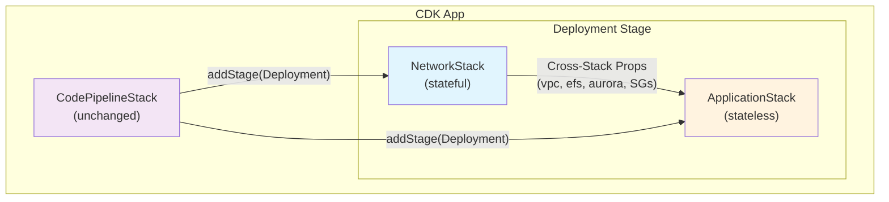
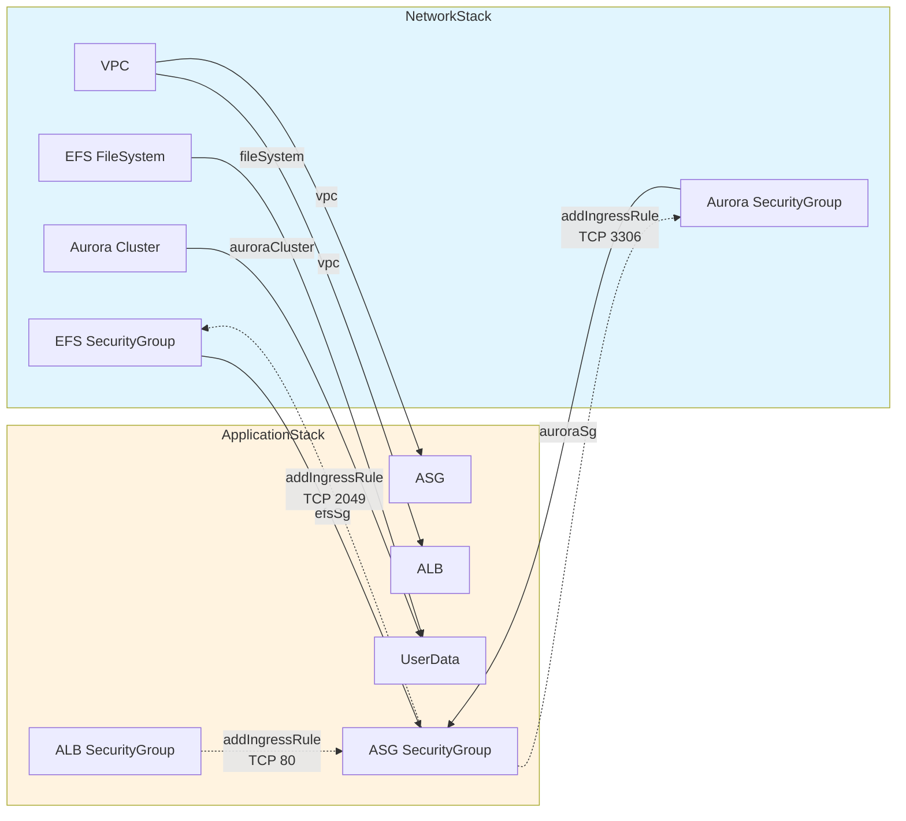

# Design Document: Moodle Stack Separation

## Overview

This design refactors the monolithic `MainStack` into two purpose-built CDK stacks:

- **NetworkStack** — stateful, rarely-changing resources: VPC, EFS, Aurora MySQL, and their security groups.
- **ApplicationStack** — stateless, frequently-changing resources: ALB, ASG, UserData, and their security groups.

The split enables independent deployment lifecycles, reduces blast radius for application changes, and protects stateful data-layer resources from accidental deletion. The existing `CodePipelineStack` remains unchanged. Cross-stack references are passed via typed CDK props interfaces, and CloudFormation outputs are preserved so that the validation script and downstream tooling continue to work.

### Key Design Decisions

1. **Security groups co-located with their primary resource** — EFS SG and Aurora SG live in NetworkStack (they protect stateful resources), while ALB SG and ASG SG live in ApplicationStack (they protect stateless compute). Cross-stack ingress rules are added in ApplicationStack using the imported SG references.
2. **Explicit CDK dependency** — `ApplicationStack.addDependency(NetworkStack)` ensures CloudFormation deploys NetworkStack first within the pipeline stage.
3. **Props-based cross-stack wiring** — A single `ApplicationStackProps` interface carries all references from NetworkStack to ApplicationStack. CDK automatically creates CloudFormation exports/imports under the hood.
4. **Validation script targets ApplicationStack** — The ALB lives in ApplicationStack, so the validation script queries `{STAGE}-ApplicationStack` instead of `{STAGE}-MainStack`.

## Architecture

### Three-Stack Model



### Cross-Stack Reference Flow



### Security Group Matrix

| Security Group | Stack | Inbound Rules | Outbound Rules |
|---|---|---|---|
| **ALB SG** | ApplicationStack | TCP 80 from `0.0.0.0/0` | TCP 80 to ASG SG |
| **ASG SG** | ApplicationStack | TCP 80 from ALB SG | All (default) |
| **EFS SG** | NetworkStack | TCP 2049 from ASG SG *(added by ApplicationStack)* | None (allowAllOutbound: false) |
| **Aurora SG** | NetworkStack | TCP 3306 from ASG SG *(added by ApplicationStack)* | None (allowAllOutbound: false) |

Cross-stack ingress rules (EFS SG ← ASG SG, Aurora SG ← ASG SG) are added in ApplicationStack's constructor using the SG references received via props. CDK resolves these as CloudFormation cross-stack imports automatically.

## Components and Interfaces

### File Structure

| File | Action | Description |
|---|---|---|
| `lib/network-stack.ts` | **New** | NetworkStack class |
| `lib/application-stack.ts` | **New** | ApplicationStack class |
| `lib/stages.ts` | **Update** | Replace MainStack with NetworkStack + ApplicationStack |
| `bin/code_pipeline.ts` | **Update** | Replace standalone MainStack with NetworkStack + ApplicationStack |
| `test/network-stack.test.ts` | **New** | Unit tests for NetworkStack |
| `test/application-stack.test.ts` | **New** | Unit tests for ApplicationStack |
| `test/test_validate.sh` | **Update** | Change stack name from MainStack to ApplicationStack |
| `lib/main-stack.ts` | **Delete** | Replaced by NetworkStack + ApplicationStack |
| `test/main-stack.test.ts` | **Delete** | Replaced by new test files |
| `lib/pipeline-stack.ts` | **Unchanged** | No changes needed |
| `test/pipeline-stack.test.ts` | **Update** | Update resource counts if they change |

### TypeScript Interfaces

```typescript
// lib/network-stack.ts
import { Stack, StackProps, CfnOutput, RemovalPolicy } from 'aws-cdk-lib';
import * as ec2 from 'aws-cdk-lib/aws-ec2';
import * as efs from 'aws-cdk-lib/aws-efs';
import * as rds from 'aws-cdk-lib/aws-rds';
import { Construct } from 'constructs';

export class NetworkStack extends Stack {
  /** The VPC shared with ApplicationStack */
  public readonly vpc: ec2.Vpc;
  /** The EFS file system for Moodle data */
  public readonly fileSystem: efs.FileSystem;
  /** The Aurora MySQL Serverless v2 cluster */
  public readonly auroraCluster: rds.DatabaseCluster;
  /** Security group protecting EFS — ingress added by ApplicationStack */
  public readonly efsSg: ec2.SecurityGroup;
  /** Security group protecting Aurora — ingress added by ApplicationStack */
  public readonly auroraSg: ec2.SecurityGroup;

  constructor(scope: Construct, id: string, props?: StackProps) {
    super(scope, id, props);
    // ... resource creation (VPC, EFS, Aurora, SGs, CfnOutputs)
  }
}
```

```typescript
// lib/application-stack.ts
import { Stack, StackProps, CfnOutput } from 'aws-cdk-lib';
import * as ec2 from 'aws-cdk-lib/aws-ec2';
import * as efs from 'aws-cdk-lib/aws-efs';
import * as elbv2 from 'aws-cdk-lib/aws-elasticloadbalancingv2';
import * as autoscaling from 'aws-cdk-lib/aws-autoscaling';
import * as rds from 'aws-cdk-lib/aws-rds';
import { Construct } from 'constructs';

export interface ApplicationStackProps extends StackProps {
  /** VPC from NetworkStack */
  vpc: ec2.Vpc;
  /** EFS file system from NetworkStack */
  fileSystem: efs.FileSystem;
  /** Aurora cluster from NetworkStack */
  auroraCluster: rds.DatabaseCluster;
  /** EFS security group from NetworkStack — ingress rule added here */
  efsSg: ec2.SecurityGroup;
  /** Aurora security group from NetworkStack — ingress rule added here */
  auroraSg: ec2.SecurityGroup;
}

export class ApplicationStack extends Stack {
  constructor(scope: Construct, id: string, props: ApplicationStackProps) {
    super(scope, id, props);
    // ... resource creation (ALB, ASG, SGs, UserData, cross-stack ingress, CfnOutputs)
  }
}
```

```typescript
// lib/stages.ts (updated)
import { Stage, StageProps } from 'aws-cdk-lib';
import { Construct } from 'constructs';
import { NetworkStack } from './network-stack';
import { ApplicationStack } from './application-stack';

export class Deployment extends Stage {
  constructor(scope: Construct, id: string, props?: StageProps) {
    super(scope, id, props);

    const networkStack = new NetworkStack(this, 'NetworkStack', {
      description: 'Stateful networking and data-layer resources for Moodle.',
    });

    const applicationStack = new ApplicationStack(this, 'ApplicationStack', {
      description: 'Stateless compute and load-balancing resources for Moodle.',
      vpc: networkStack.vpc,
      fileSystem: networkStack.fileSystem,
      auroraCluster: networkStack.auroraCluster,
      efsSg: networkStack.efsSg,
      auroraSg: networkStack.auroraSg,
    });

    applicationStack.addDependency(networkStack);
  }
}
```

```typescript
// bin/code_pipeline.ts (updated)
#!/usr/bin/env node
import 'source-map-support/register';
import * as cdk from 'aws-cdk-lib';
import { CodePipelineStack } from '../lib/pipeline-stack';
import { NetworkStack } from '../lib/network-stack';
import { ApplicationStack } from '../lib/application-stack';

const app = new cdk.App();
new CodePipelineStack(app, 'CodePipeline');

const networkStack = new NetworkStack(app, 'Dev-NetworkStack');
new ApplicationStack(app, 'Dev-ApplicationStack', {
  vpc: networkStack.vpc,
  fileSystem: networkStack.fileSystem,
  auroraCluster: networkStack.auroraCluster,
  efsSg: networkStack.efsSg,
  auroraSg: networkStack.auroraSg,
});
```

### NetworkStack Constructor Detail

The constructor creates resources in this order:

1. **VPC** — 2 AZs, 1 NAT Gateway, public + private-with-egress subnets (identical to current MainStack).
2. **EFS Security Group** — `allowAllOutbound: false`, no ingress rules yet (added by ApplicationStack).
3. **Aurora Security Group** — `allowAllOutbound: false`, no ingress rules yet (added by ApplicationStack).
4. **EFS FileSystem** — encrypted, bursting throughput, general-purpose performance, private subnets, DESTROY removal policy.
5. **Aurora DatabaseCluster** — aurora-mysql 3.04.0, serverless v2 (0.5–2 ACU), single writer, private subnets, generated credentials (`moodleadmin`), database `moodle`, DESTROY removal policy.
6. **CfnOutputs** — `EfsFileSystemId`, `AuroraClusterEndpoint`.

### ApplicationStack Constructor Detail

The constructor receives `ApplicationStackProps` and creates resources in this order:

1. **ALB Security Group** — `allowAllOutbound: false`, inbound TCP 80 from `0.0.0.0/0`, outbound TCP 80 to ASG SG.
2. **ASG Security Group** — default outbound, inbound TCP 80 from ALB SG.
3. **Cross-stack ingress rules** — Add TCP 2049 from ASG SG to `props.efsSg`, add TCP 3306 from ASG SG to `props.auroraSg`.
4. **ALB** — internet-facing, public subnets, ALB SG.
5. **ASG** — t3.medium, Amazon Linux 2023, min 1 / max 2, private subnets, ASG SG.
6. **Secret grant** — `props.auroraCluster.secret.grantRead(asg.role)`.
7. **Listener + Target Group** — port 80, health check path `/`, codes `200-399`.
8. **UserData** — identical script to current MainStack, referencing `props.auroraCluster` and `props.fileSystem`.
9. **CfnOutput** — `AlbDnsName`.

### Validation Script Update

```bash
# Current
STACK_NAME="${STAGE}-MainStack"
# Updated
STACK_NAME="${STAGE}-ApplicationStack"

# Local default also changes
STAGE="Dev"
# So default becomes: Dev-ApplicationStack
```

## Data Models

### CloudFormation Outputs

| Output Key | Stack | Value | Consumer |
|---|---|---|---|
| `EfsFileSystemId` | NetworkStack | `fileSystem.fileSystemId` | Monitoring, debugging |
| `AuroraClusterEndpoint` | NetworkStack | `auroraCluster.clusterEndpoint.hostname` | Monitoring, debugging |
| `AlbDnsName` | ApplicationStack | `alb.loadBalancerDnsName` | Validation script, DNS config |

### Cross-Stack CloudFormation Exports (auto-generated by CDK)

When ApplicationStack references NetworkStack resources via props, CDK automatically creates `Fn::Export` in NetworkStack and `Fn::ImportValue` in ApplicationStack for each cross-stack reference. These include:

- VPC ID and subnet IDs
- EFS file system ID
- Aurora cluster endpoint, secret ARN
- EFS security group ID
- Aurora security group ID

These are managed by CDK and do not require manual `CfnOutput`/`Fn::ImportValue` calls.

## Error Handling

### Deployment Ordering Failures

- **Mitigation**: `applicationStack.addDependency(networkStack)` ensures CloudFormation will not attempt to create ApplicationStack resources before NetworkStack is complete.
- **Pipeline behavior**: If NetworkStack deployment fails, the pipeline stage fails and ApplicationStack deployment is skipped.

### Cross-Stack Reference Deletion Protection

- **Risk**: Deleting or modifying a NetworkStack export that ApplicationStack depends on will cause a CloudFormation error.
- **Mitigation**: CDK prevents removal of exports that are actively imported by another stack. To remove a cross-stack reference, the consuming stack must be updated first.

### Security Group Circular Dependency Avoidance

- **Risk**: If both stacks try to reference each other's security groups in their constructors, CloudFormation will detect a circular dependency.
- **Mitigation**: EFS SG and Aurora SG are created in NetworkStack with no ingress rules. Ingress rules referencing ASG SG are added in ApplicationStack. This creates a one-directional dependency (ApplicationStack → NetworkStack), avoiding circularity.

### Secret ARN Resolution

- **Risk**: `auroraCluster.secret` could be `undefined` if credentials are not generated.
- **Mitigation**: NetworkStack always uses `Credentials.fromGeneratedSecret('moodleadmin')`, guaranteeing a secret exists. ApplicationStack uses a null-check guard (`if (props.auroraCluster.secret != null)`) consistent with the current MainStack pattern.

### Validation Script Compatibility

- **Risk**: The validation script fails if the stack name doesn't match.
- **Mitigation**: Update the script to use `${STAGE}-ApplicationStack` and default `STAGE=Dev`. The ALB output key `AlbDnsName` is preserved unchanged.

## Testing Strategy

### Why Property-Based Testing Does Not Apply

This feature is purely Infrastructure as Code (CDK). The changes involve:
- Splitting CDK constructs across stacks
- Passing typed props between stacks
- Verifying CloudFormation resource composition via CDK assertions

There are no pure functions, parsers, serializers, or business logic with variable input spaces. CDK assertion tests (`Template.fromStack()` + `hasResourceProperties` / `resourceCountIs` / `hasOutput`) are the appropriate testing approach.

### Unit Tests — NetworkStack (`test/network-stack.test.ts`)

| Test | Assertion | Validates |
|---|---|---|
| VPC exists | `resourceCountIs('AWS::EC2::VPC', 1)` | Req 1.1 |
| EFS encrypted, bursting, general-purpose | `hasResourceProperties('AWS::EFS::FileSystem', ...)` | Req 1.2 |
| Aurora engine and serverless config | `hasResourceProperties('AWS::RDS::DBCluster', ...)` | Req 1.3 |
| Aurora single writer instance | `resourceCountIs('AWS::RDS::DBInstance', 1)` | Req 1.3 |
| Aurora deletion protection off | `hasResourceProperties('AWS::RDS::DBCluster', { DeletionProtection: false })` | Req 1.3 |
| EFS output exists | `hasOutput('EfsFileSystemId', {})` | Req 6.2 |
| Aurora output exists | `hasOutput('AuroraClusterEndpoint', {})` | Req 6.3 |

### Unit Tests — ApplicationStack (`test/application-stack.test.ts`)

| Test | Assertion | Validates |
|---|---|---|
| ALB is internet-facing | `hasResourceProperties('AWS::ElasticLoadBalancingV2::LoadBalancer', { Scheme: 'internet-facing' })` | Req 2.2 |
| ALB listener on port 80 | `hasResourceProperties('AWS::ElasticLoadBalancingV2::Listener', { Port: 80 })` | Req 2.2 |
| ASG capacity min 1, max 2 | `hasResourceProperties('AWS::AutoScaling::AutoScalingGroup', { MinSize: '1', MaxSize: '2' })` | Req 2.3 |
| ASG instance type t3.medium | `hasResourceProperties('AWS::AutoScaling::LaunchConfiguration', { InstanceType: 't3.medium' })` | Req 2.3 |
| ALB DNS output exists | `hasOutput('AlbDnsName', {})` | Req 6.1 |

### Unit Tests — Pipeline Stack (`test/pipeline-stack.test.ts`)

The existing pipeline tests remain. Resource counts may need updating if the new two-stack stage produces different pipeline action counts. The test for "Only Dev stage exists" remains valid since the stage name is still `Dev`.

### Integration / Validation Tests

The existing `test/test_validate.sh` script is updated to query `${STAGE}-ApplicationStack` and continues to perform the HTTP health check against the ALB DNS name.

### Test Execution

All tests run via `npm run test` (Jest) as configured in `package.json`. No new test frameworks or dependencies are needed.
